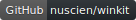

# Trivial.WindowsKit

Includes some complex controls and utilities on WinUI 3.
It is useful to create the client with collection pages of news, videos and products.

## Components and utils

Following are the commonly used controls.

- `TileItem` shows image and text.
- `TileCollection` is a horizontal list of tile.
- `CommentView` with poster information and comment.
- `BlockHeader` is a header for a group.
- `TextButton` is a button with different states that you can customize colors.
- `SettingsExpanderHeader` is the expander header like the one in Windows Settings.

And following are some utilities.

- `DependencyObjectProxy`
- `VisualUtilities`
- `BaseJsonPagingLoader`
- `JsonWebCacheClient`

## Samples

The GitHub repository includes a [demo project](https://github.com/nuscien/winkit/tree/main/Demo) with following 3rd-party data sources.

| Source | Copyright |
| -------------------- | -------------------- |
| [NBC TV Network](https://www.nbc.com/) | ©2022 NBCUniversal Media, LLC |
| [bilibili (哔哩哔哩)](https://www.bilibili.com/) | 上海宽娱数码科技有限公司 版权所有 |

Please note that the data sources are NOT parts of this library.
Their owners reserve all rights and may change the data services without notification.
The demo here to reference these is to show how to develop with this library.

You can also check the screenshots of iQIYI Windows app (爱奇艺·悦享品质) in the [demo images folder](https://github.com/nuscien/winkit/tree/main/docs/demo/images).
It uses this library to implement a number of page and part.
